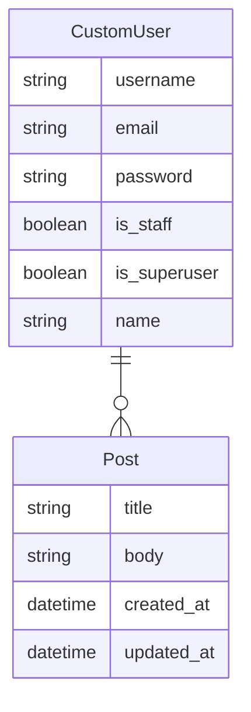

# Django Rest Framework Project: Blog API

## Project Description

This project is called "Blog API" and is built using the Django web framework
and the Django Rest Framework for REST API. It is a REST API that allows users
to perform CRUD (Create, Read, Update and Delete) operations on the blog's posts.
The main functionality of the API includes the ability to create new posts,
retrieve details of a specific post, update an existing post, and delete a post.
It also includes the ability to retrieve a list of all posts on the blog.
To achieve this, Django is used to structure the project and define the data
models, and the Django Rest Framework is used to build the REST API and handle
the CRUD operations logic.

## Endpoints

Here is a list of some endpoints available on the API:

|            Endpoint            | HTTP Verb |                     Description                      |
|:------------------------------:|:---------:|:----------------------------------------------------:|
|           `/api/v1/`           |    GET    |         Gets a list of all available posts.          |
|           `/api/v1/`           |   POST    |                 Creates a new post.                  |
|        `/api/v1/{id}/`         |    GET    |              Gets a specific post data.              |
|        `/api/v1/{id}/`         |    PUT    |        Updates all fields of a specific post.        |
|        `/api/v1/{id}/`         |   PATCH   |      Updates certain fields of a specific post.      |
|        `/api/v1/{id}/`         |  DELETE   |               Deletes a specific post.               |
| `/dj-rest-auth/registration/`  |   POST    |     Allows users to register as a new API user.      |
| `/api/v1/dj-rest-auth/login/`  |   POST    |              Allows log in as API user.              |
| `/api/v1/dj-rest-auth/logout/` |    GET    |             Allows API users to log out.             |
|         `/api/schema/`         |    GET    |        Allows the download of the API schema.        |
|      `/api/schema/redoc/`      |    GET    |   Shows the full API documentation using *Redoc*.    |
|   `/api/schema/swagger-ui/`    |    GET    | Shows the full API documentation using *Swagger UI*. |

## Entity Relationship Diagram

NOTE: The 'CustomUser' model inherits Django's built-in 'AbstractUser' model
that haves many other attributes in it. Check the [official documentation](https://docs.djangoproject.com/en/4.1/ref/contrib/auth/)
for more info.

## Tech Stack
* Python 3
* Django (web framework)
* Django Rest Framework (API REST framework)
* PostgreSQL (database management system)
